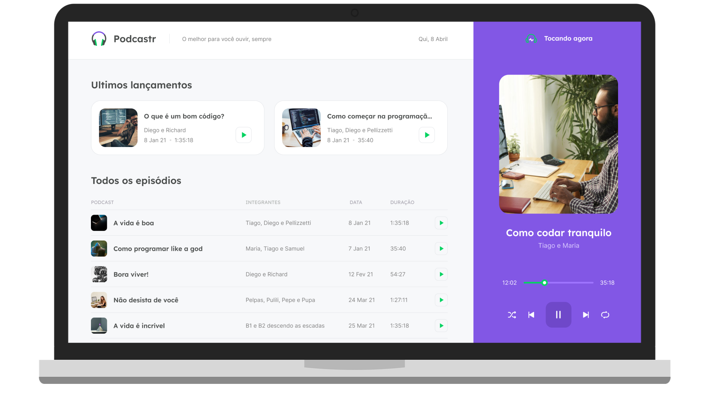

<h1 align="center">
  
</h1>

<p align="center">
  

     
</p>

<p align="center">
  
</p>

## :computer: Projeto

O Podcastr é um app para reprodução de episódios em áudio do seu podcast favorito.

## :zap: Tecnologias

* [React](https://pt-br.reactjs.org/)
* [Next.js](https://nextjs.org/)
* [TypeScript](https://www.typescriptlang.org/)

## :bookmark: Layout

O protótipo da versão Web se encontra no link abaixo:

* [Protótipo - Figma](https://www.figma.com/file/bFKdDwaSrxwOnn88TNOCyd/Podcastr?node-id=160%3A2761)

## :rocket: Como executar

1) Clone o repositório

2) Instale as dependências com o **yarn** 

```shell
yarn install
```

3) No 1º terminal, inicie a api fake

```shell
yarn server
```

4) No 2º terminal, inicie o servidor

```shell
yarn dev
```

A aplicação estará sendo executada em `localhost:3000`

## 🎗️ License

Este projeto está sob a licença MIT. Veja o arquivo [LICENSE](LICENSE.md) para mais detalhes.
